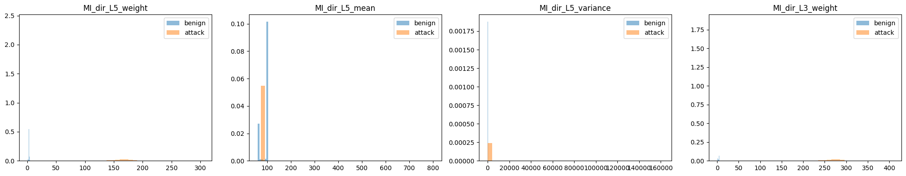
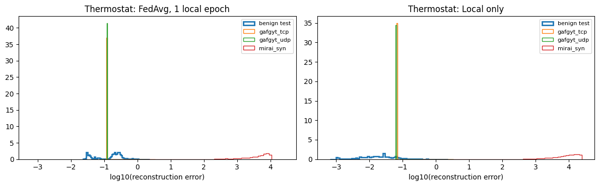
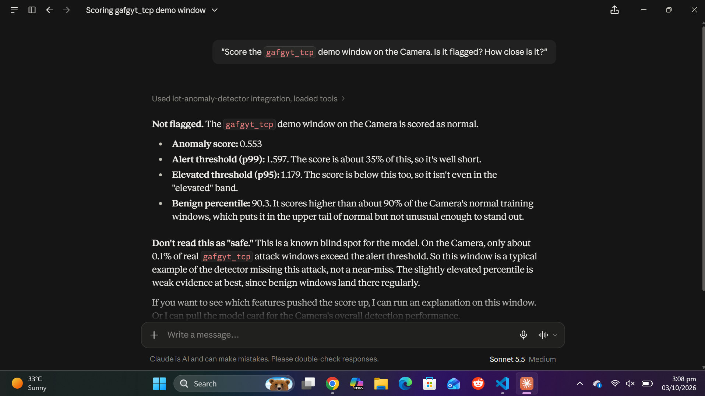
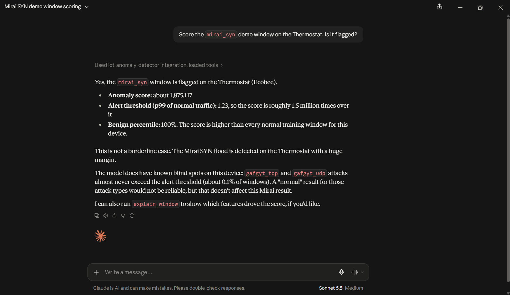

# Federated Anomaly Detection on IoT Traffic

This project compares a centralized anomaly detector against a federated one, using real botnet attack traffic captured from IoT devices. The goal was to understand how much (if any) detection accuracy you give up when you cannot centralize IoT traffic data across devices, which is the realistic constraint in most actual IoT deployments.

**Short version of what I found:** on the first, narrow evaluation (4 attack types), federated learning looked like it cost nothing (0.99998 AUC vs 0.99999 centralized). Extending to all 10 attack types, that holds for 8 of them: every method, including plain FedAvg, scores AUC 0.9998 to 1.0000 and catches at least 99.7% of attack rows at 1% false alarms. The weaker pooled score for plain FedAvg (0.95 AUC) comes almost entirely from two near-duplicate attack files (`gafgyt_tcp`, `gafgyt_udp`, about 20 distinct rows each), where plain FedAvg scores 0.66 to 0.75 AUC. Even the best methods catch those two files at 1% false alarms on only some devices. Federation also did not beat simply training one model per device in this setup. The trained detector is also exposed to an LLM through an MCP server (`mcp_server/`) that returns each verdict together with its percentile among normal traffic and the model's known blind spots. Details and caveats below.

## Motivation

IoT devices generate huge amounts of traffic, and a lot of that traffic could be useful for training security models. But in practice, different devices often belong to different owners, companies, or networks, and pooling their raw traffic centrally raises privacy and bandwidth concerns. Federated learning offers a way around this: each device trains a local model on its own data, and only the model's learned parameters get shared with a central server, which aggregates them into an improved global model. Raw traffic never leaves the device.

This project builds and compares both approaches on the same problem, using the same underlying model, so the comparison is as fair as I could make it (see the limitations for where it is not).

## Dataset

[N-BaIoT](https://archive.ics.uci.edu/dataset/442/detection+of+iot+botnet+attacks+n+baiot), from the UCI Machine Learning Repository. It contains real network traffic captured from 9 commercial IoT devices, including both benign traffic and traffic recorded while the devices were infected with Mirai or BASHLITE (gafgyt) botnet malware. Each row is a pre-engineered feature vector (115 statistical features per traffic window), so there is no raw packet parsing involved.

I used the [Kaggle mirror](https://www.kaggle.com/datasets/mkashifn/nbaiot-dataset) of this dataset since it is easier to pull directly into Google Colab than the original UCI zip file.

I worked with 4 of the 9 devices:
- Danmini Doorbell
- Ecobee Thermostat
- Philips B120N10 Baby Monitor
- SimpleHome XCS7 1002 Security Camera

## Repo contents

| File | What it is |
|---|---|
| `01_data_exploration.ipynb` | Notebook 1: data exploration, builds the labeled dataset |
| `02_baseline_centralized.ipynb` | Notebook 2: centralized baseline (Isolation Forest and autoencoder) |
| `03_federated_flower.ipynb` | Notebook 3: federated learning with Flower |
| `04_extension_noniid_unseen.ipynb` | Extension: all 10 attack types, non-IID experiments, unseen devices, diagnostics |
| `mcp_server/` | MCP server that exposes the trained model to an LLM (scoring, explanations, model card), with tests and a demo script |

## What I did

### Notebooks 1 to 3: first pass

**Notebook 1, data exploration.** Loaded benign and attack traffic for each device, checked for missing values (none), and plotted feature distributions for both classes. Built a combined, labeled dataset across all 4 devices (1,344,470 rows) and saved it for the next parts. This dataset used 4 attack types per device (2 gafgyt, 2 mirai: `gafgyt_combo`, `gafgyt_junk`, `mirai_ack`, `mirai_scan`).

**Notebook 2, centralized baseline.** Trained two anomaly detectors with all data in one place. Both were trained only on benign traffic and evaluated on held-out benign plus attack traffic, since in a real deployment you do not have labeled attack examples ahead of time.
- Isolation Forest (via PyOD)
- A small autoencoder (PyTorch), using reconstruction error as the anomaly score

**Notebook 3, federated learning.** Reframed the same problem using Flower (1.39.0). Each of the 4 devices was a separate federated client training the same autoencoder on its own benign traffic, with FedAvg aggregation over 10 rounds. Each client ran 5 full-batch gradient steps per round (not 5 passes over minibatches). No raw traffic was shared, only model weights. The notebook checks that all 4 clients trained and reported in every round.

### Extension: harder questions

The first results looked almost perfect, so I went back and stress tested them. The extension notebook asks three questions:

1. **Attack coverage.** Does the model still work on all 10 attack types per device, not just the 4 used in the first evaluation?
2. **Non-IID data.** The devices differ a lot in traffic patterns and in data size (thermostat about 9k benign training rows, baby monitor about 123k). Does plain FedAvg suffer, and do FedProx, equal client weighting, or local scaling help?
3. **Unseen devices.** If a new device joins after training, does the global model work on it?

I then ran three diagnostics to understand the one clear failure the extension found.

Notes on the setup:
- Every model trains on benign traffic only, so *every* attack is unseen at training time. The first evaluation's gap was coverage (6 of 10 attack types were never tested), not training exposure.
- Because training is benign only, labels cannot be skewed across clients. The non-IID skew here comes from the devices themselves: different feature scales, traffic patterns and data sizes.
- Federated training in this notebook is a plain PyTorch loop instead of Flower simulation, so many configurations can be run quickly. It implements the same FedAvg algorithm.
- Local training uses real minibatches (batch size 256), Adam, lr 1e-3, 10 rounds. Centralized and local-only models train for 10 epochs.
- Every result is the average of 3 seeds, shown with the sample standard deviation (n-1) across seeds. Seeds change initialization and batch order, not the data split.
- Each attack file is capped at 20,000 random rows to fit in Colab memory.
- The shared feature scaler is built from per-client row counts, sums and sums of squares, so no raw rows are shared. It matches a scaler fit on pooled data.
- Two thresholds are used. The deployable one is a percentile (95th or 99th) of each device's own benign *training* error. "TPR at 1% FPR" instead sets the threshold at the 99th percentile of the device's held-out benign *test* error. That is an evaluation operating point, not something a deployment could compute without labeled data.

## Results

### First pass (4 attack types)

**Centralized (notebook 2):**
- Isolation Forest: 0.9759 ROC-AUC
- Autoencoder: 0.99999 ROC-AUC (0.999988)

**Federated (notebook 3; FedAvg, 10 rounds, 4 devices, all 4 clients every round):**
- Average across devices, final round: 0.99998 ROC-AUC
- Per device: Doorbell 0.999997, Thermostat 1.000000, Baby Monitor 0.999998, Security Camera 0.99992

On this evaluation, federated matched centralized. Notebooks 2 and 3 use the same benign train/test rows and the same scaler, but notebook 2 reports one pooled AUC while notebook 3 averages per-device AUCs, and the training budgets differ (30 epochs of minibatches vs 10 rounds of 5 full-batch steps). The federated average was already 0.99997 after round 1, so this evaluation cannot tell how much training matters. It only shows that these 4 attack types are easy. The extension shows this holds for 8 of the 10 attack types, but not for the two remaining ones (`gafgyt_tcp`, `gafgyt_udp`), which this first evaluation never tested.

### Extension: all 10 attack types

Mean ROC-AUC over the 4 devices, all 10 attack types pooled (mean ± sample std over 3 seeds), and attack recall at the 95th-percentile threshold:

| Method | AUC | Attack recall (TPR), 95th-pct threshold |
|---|---|---|
| FedProx (mu=0.1), 5 local epochs | 0.9959 ± 0.0016 | 0.966 |
| FedAvg, local scalers | 0.9935 ± 0.0005 | 0.950 |
| Local only (no federation) | 0.9910 ± 0.0030 | 0.950 |
| Centralized (pooled) | 0.9877 ± 0.0027 | 0.883 |
| **FedAvg, 1 local epoch, shared scaler** | **0.9506 ± 0.0301** | 0.883 |
| FedAvg, equal client weights | 0.9420 ± 0.0144 | 0.850 |
| FedAvg, 5 local epochs | 0.9326 ± 0.0061 | 0.883 |

The TPR column is roughly 0.8 + 0.2 × (recall on `gafgyt_tcp`/`gafgyt_udp`), because the other 8 attack types are caught almost perfectly, so it mostly measures those two files.

Per device AUC (mean over seeds):

| Method | Doorbell | Thermostat | Baby Monitor | Camera |
|---|---|---|---|---|
| FedProx (mu=0.1), 5 local epochs | 0.9991 | 0.9994 | 0.9971 | 0.9881 |
| FedAvg, local scalers | 0.9981 | 0.9968 | 0.9974 | 0.9817 |
| Local only | 0.9991 | 0.9794 | 0.9952 | 0.9904 |
| Centralized (pooled) | 0.9977 | 0.9781 | 0.9890 | 0.9860 |
| FedAvg, 1 local epoch | 0.9979 | 0.8974 | 0.9906 | 0.9167 |
| FedAvg, equal client weights | 0.9971 | 0.8660 | 0.9689 | 0.9359 |
| FedAvg, 5 local epochs | 0.9972 | 0.8569 | 0.9895 | 0.8868 |

The same results split by attack group (mean over 4 devices and 3 seeds, sample std):

| Method | AUC, 8 well-posed attacks | AUC, `gafgyt_tcp` + `gafgyt_udp` only |
|---|---|---|
| FedProx (mu=0.1), 5 local epochs | 1.0000 | 0.9797 ± 0.0081 |
| FedAvg, local scalers | 1.0000 | 0.9676 ± 0.0026 |
| Local only | 1.0000 | 0.9551 ± 0.0151 |
| Centralized (pooled) | 1.0000 | 0.9385 ± 0.0134 |
| FedAvg, 1 local epoch | 0.9999 | 0.7537 ± 0.1506 |
| FedAvg, equal client weights | 0.9999 | 0.7102 ± 0.0719 |
| FedAvg, 5 local epochs | 0.9998 | 0.6635 ± 0.0304 |

At stricter operating points (mean over 4 devices and 3 seeds, sample std):

| Method | TPR at 1% FPR, 8 well-posed | Benign recall, 99th-pct threshold | Attack recall, 99th-pct threshold (8 well-posed) | TPR at 1% FPR, tcp+udp |
|---|---|---|---|---|
| FedProx (mu=0.1), 5 local epochs | 0.9990 | 0.9881 | 0.9990 | 0.583 ± 0.144 |
| FedAvg, local scalers | 0.9996 | 0.9928 | 0.9995 | 0.334 ± 0.144 |
| Local only | 0.9998 | 0.9888 | 0.9998 | 0.250 ± 0.000 |
| Centralized (pooled) | 0.9998 | 0.9884 | 0.9998 | 0.084 ± 0.144 |
| FedAvg, 1 local epoch | 0.9979 | 0.9870 | 0.9980 | 0.084 ± 0.144 |
| FedAvg, equal client weights | 0.9988 | 0.9875 | 0.9989 | 0.0003 ± 0.000 |
| FedAvg, 5 local epochs | 0.9972 | 0.9873 | 0.9974 | 0.0003 ± 0.000 |

What this shows:

- **On 8 of the 10 attack types, every method is essentially perfect.** Mean AUC is 0.9998 to 1.0000 for all seven setups, including plain FedAvg, and every method catches at least 99.7% of attack rows at 1% false alarms (weakest single cell: Camera with 5 local FedAvg epochs, 0.9897). Federated training matched centralized and local-only training there.
- **The whole difference between methods comes from two attack files.** `gafgyt_tcp` and `gafgyt_udp` are near-copies of each other with only 17 to 27 distinct rows per 20,000 (see the diagnostics below). They are 20% of the pooled attack rows, so they decide the pooled ranking.
- **On those two files, plain FedAvg is weak and unstable.** It scores 0.66 to 0.75 AUC, with Thermostat 0.49 and Camera 0.58 for the main setup, and a seed standard deviation of 0.15. FedProx (0.980), local scalers (0.968), local only (0.955) and pooled (0.939) do better.
- **Even the better methods mostly miss these two files at an operating point.** TPR at 1% FPR is 0.0003 to 0.58. The means sit at multiples of 1/12 (0.083, 0.25, 0.33, 0.58), which is what you get if each device-seed run catches essentially all or none of these rows.
- **Federation did not beat local-only in this setup.** Local only (0.9910) matches or is within noise of the best federated methods. Each of the 4 clients is a different device type with plenty of benign data, which is the case where federation has the least to offer (see limitations).
- **Equal client weighting did not help overall** (mixed by device), so data size imbalance alone does not explain the FedAvg gap.
- **Differences among the better setups are within noise.** FedProx, local scalers, local only and pooled differ by about one seed standard deviation or less, so I do not rank them.

### Diagnostics on `gafgyt_tcp` and `gafgyt_udp`

These three checks (in notebook 04) explain what the two hard files are and why plain FedAvg fails on them.

- **Near-copies, very repetitive.** The two files share only 1 identical row per device, but their feature means differ by at most 0.1 benign standard deviations, and each has only 17 to 27 distinct rows out of 20,000. The other 8 attack files per device are fully distinct (20,000 of 20,000).
- **Easy to separate by raw features.** 47 to 51 individual features separate each of these attacks from benign traffic (univariate separation above 0.9), more than for the easy `mirai_syn` control (30 to 35). So the problem is not that they look like normal traffic.
- **One fixed point, shared across devices.** With a shared scaler, both attacks have the same median reconstruction error on all four devices for a given model (0.1246 for FedAvg 1 epoch, 0.0857 for 5 epochs, 0.0719 for equal weights, 0.0911 pooled, 4.4455 FedProx). That points to the same fixed point on every device, though I did not compare the raw rows across devices directly.
- **The AUC behaves like a threshold effect.** That error is small next to an easy attack (`mirai_syn`: 5,000 or more). In the 5 of 28 device-method pairs (seed 0) where it falls below the device's median benign error (all plain FedAvg variants on Thermostat or Camera), AUC is 0.31 to 0.47. In every other pair it is above 0.83. So 0.49 versus 0.99 mostly reflects whether one point lands above or below normal traffic, not a graded difference in detection ability.
- **Fit on normal traffic explains only part of it.** Plain FedAvg fits Thermostat and Camera benign traffic much worse than local-only models (median benign error 0.20 and 0.14 versus 0.02 and 0.0025). But FedProx has higher benign error than FedAvg 1 epoch on 3 of 4 devices and still scores best on these files, because it reconstructs the fixed point poorly (error 4.4 versus 0.07 to 0.12). Rank correlation between benign error and tcp/udp AUC across shared-scaler setups is only -0.42 (24 pairs, not independent), and -0.09 to -0.37 per device.
- **The simple "device scales differ" explanation is weakened.** Local-only and pooled models use the same shared scaler as plain FedAvg and score well, so the shared scaler alone is not the cause. Local scaling probably helps by making the clients' data more alike, which reduces drift under averaging, but I did not test that.

### Extension: unseen devices

Leave one device out: train FedAvg on 3 devices, then test on the fourth (mean over 3 seeds). "Fleet scaler" reuses the other devices' normalization; "own scaler" is computed from the new device's benign training traffic. The threshold always comes from the new device's own benign training rows.

| Held-out device | AUC, all 10 (fleet / own) | AUC, 8 well-posed (fleet / own) | AUC, tcp+udp (fleet / own) | TPR at 1% FPR, 8 well-posed (fleet / own) |
|---|---|---|---|---|
| Doorbell | 0.9974 / 0.9964 | 1.0000 / 1.0000 | 0.9869 / 0.9822 | 0.9999 / 1.0000 |
| Thermostat | 0.8616 / 0.9855 | 0.9998 / 1.0000 | 0.3088 / 0.9275 | 0.9995 / 1.0000 |
| Baby Monitor | 0.9230 / 0.9820 | 0.9986 / 1.0000 | 0.6206 / 0.9099 | 0.9715 / 0.9998 |
| Camera | 0.8782 / 0.9814 | 0.9995 / 0.9998 | 0.3931 / 0.9079 | 0.9840 / 0.9966 |

A new device is detected almost perfectly on the 8 well-posed attacks with either scaler. The drop in the all-10 AUC with the fleet scaler comes from `gafgyt_tcp`/`gafgyt_udp`. Computing its own scaler mainly matters at the operating point: it restores recall at 1% false alarms on the Baby Monitor (0.9715 to 0.9998) and Camera (0.9840 to 0.9966). I did not compare against simply training a local model on the new device, which needs the same benign traffic.

### Note on thresholds and recall

Two thresholds appear above, and they answer different questions.

- **95th percentile of benign training error** (first extension table): benign recall is about 0.95 by construction, which is a 5% false-alarm rate and too noisy for real use. Because 8 of the 10 attack types are caught almost perfectly, the TPR column there mostly measures `gafgyt_tcp`/`gafgyt_udp`.
- **99th percentile of benign training error** (stricter table): benign recall on held-out benign traffic is 0.987 to 0.993 (0.7% to 1.3% false alarms) and recall on the 8 well-posed attacks stays at 0.9974 to 0.9998.

## Model and setup details

Autoencoder architecture: input (115 features) -> 64 -> 16 (latent) -> 64 -> 115, ReLU activations, MSE loss, Adam (lr=1e-3).

Isolation Forest: contamination=0.1, PyOD's default implementation.

Centralized baseline (Notebook 2): 30 epochs, batch size 256, with the benign data split 70/30 in file order per device (the same split as notebooks 3 and 4), all attack samples added to the test set, scaler fit on the pooled benign training rows. Training loss was still falling slowly at epoch 30, but AUC was already about 1.0.

Federated, Notebook 3 (Flower 1.39.0): FedAvg, 10 rounds, 5 full-batch Adam steps per client per round (optimizer state reset each round), all 4 clients every round, 70/30 benign split in file order. The shared scaler comes from per-client train-row sums, so test rows do not influence it. Each simulated client loads only its own data file.

Federated, extension: see "Notes on the setup" above.

## Honest limitations

- **Only 4 of the 9 devices, and only 4 clients.** The federation is a simulation on one machine, with no latency, dropped devices or communication cost.
- **The value of federation is not demonstrated.** Each client is a different device type with plenty of benign data, and local-only models match the best federated ones. Federation would be expected to help when there are many similar clients with little data each (for example, many doorbells with a few minutes of traffic). I did not test that.
- **Three seeds, and seeds change only initialization and batch order, not the data split.** The ranking of the better methods is not settled. Only the gap between them and plain FedAvg on `gafgyt_tcp`/`gafgyt_udp` is clearly larger than the noise.
- **The two hard attacks are one weak, repeated signal.** They have only 17 to 27 distinct rows per 20,000 and are near-copies of each other, so method rankings on them reflect how a model happens to treat one point (its error ranges from 0.07 to 4.4 across methods), not general detection quality. They are 20% of the pooled attack rows, so they weigh heavily in pooled AUC and TPR despite carrying little information.
- **The cause of the FedAvg failure on these two files is not isolated.** The scaler explanation is weakened, and poor fit to normal Thermostat and Camera traffic explains only part of it. I have not tested whether the fixed point sits near the fleet-average point in scaled space.
- **Local scaling may flatter the results.** Features that barely move in benign traffic get tiny standard deviations, which can turn small attack deviations into large z-scores. I did not test this.
- **The benign test set is the last 30% of each capture.** Adjacent windows are correlated, and the test rows come from the same capture session as training, so I did not measure generalization across time or sessions. False-alarm rates are therefore rough estimates (the Thermostat has about 4k benign test rows).
- **Hyperparameters were not tuned.** FedProx uses a single mu (0.1), and learning rate and epochs are fixed.
- **Notebooks 2 and 3 are not perfectly matched.** They share data and scaler but differ in aggregation (pooled AUC vs mean of per-device AUCs) and training budget.
- **The dataset is easy.** Attack traffic is statistically very distinct from benign traffic for most attack types, which is why most scores are near 1.0. Published N-BaIoT papers report similarly high numbers.
- **Attack files are subsampled** to 20,000 rows each in the extension. AUC should be stable at that size, but I did not test other sizes.
- **No privacy analysis.** Sharing weights instead of data reduces exposure, but model updates can still leak information. I used no differential privacy or secure aggregation.

## MCP server: querying the trained model from an LLM

`mcp_server/` wraps the exported FedAvg + local-scalers autoencoder in a [Model Context Protocol](https://modelcontextprotocol.io) server, so an LLM client such as Claude Desktop can score IoT traffic windows and explain why they were flagged. The weights, per-device scalers and thresholds are produced by the last cells of notebook 04.

- **Tools:** `list_devices`, `get_model_card`, `score_window`, `explain_window`, `list_features`.
- **Context with every verdict:** each score reports where it falls among that device's normal training windows (benign percentile), a band (normal, elevated, flagged) and the model's known blind spots on that device. The experiments above showed that `gafgyt_tcp`/`udp` can sit in the top 10% of normal traffic and still stay under the alert threshold, which a plain flagged/not-flagged answer would hide.
- **Explanations:** per-feature reconstruction-error attribution (observed vs expected value, deviation from the device's normal, share of the error), with feature names decoded to plain language. It is attribution, not a causal diagnosis.
- **Engineering:** NumPy-only inference, checked against PyTorch (worst relative difference 7.1e-07 on 16 windows), 44 tests, and thresholds taken from benign training error so no attack labels are needed.
- **Checked against the LLM's answers:** I compared Claude Desktop's answers with the tool output. Scores, thresholds, percentiles and blind-spot rates matched. In some follow-up explanations Claude added claims the tool output does not support (for example, naming an attack subtype), so the server's output tells the LLM to report only the returned numbers. That reduces the problem but does not remove it.

Example from Claude Desktop (Camera, `gafgyt_tcp` demo window): Claude reports the window as not flagged at the 90.3rd benign percentile, and warns that only about 0.1% of real `gafgyt_tcp` windows exceed the alert threshold on this device.

For contrast, the `mirai_syn` demo window on the Thermostat is flagged at about 1.5 million times the alert threshold.

See [`mcp_server/README.md`](mcp_server/README.md) for setup, design decisions and demo output.

## How to run this

All notebooks are built for Google Colab.

1. Get a Kaggle API token: kaggle.com, then Settings, then API Tokens, then Generate New Token.
2. In Colab, click the key icon in the left sidebar, add a secret named `KAGGLE_TOKEN` with your token as the value, and turn on notebook access.
3. Run notebooks 01, 02 and 03 in order. Each one saves intermediate output to Google Drive under `nbaiot-project/processed` for the next one to load. Notebook 3 deletes the full dataframe after writing per-client files, so to rerun its earlier cells, restart the runtime first.
4. Run `04_extension_noniid_unseen.ipynb`. It downloads the raw data itself (about 1.75 GB, skipped if already present) and does not need steps 1 to 3. With the default 3 seeds the main experiments took roughly 15 to 20 minutes on Colab CPU, plus a few minutes for the diagnostics. It saves result CSV files to the same Drive folder.
5. To try the MCP server, follow `mcp_server/README.md`.

## What I would extend this toward

- Test why plain FedAvg fails on `gafgyt_tcp`/`gafgyt_udp` (for example, by varying feature scaling and training length while holding everything else fixed), and check why reconstruction error misses attacks that single features separate almost perfectly.
- Redesign the federation as many small clients of the same device type, to test the setting where federation should help.
- Compare FedAvg against a more robust aggregation strategy (median or trimmed mean) under simulated data poisoning, where one client sends bad updates.
- Use all 9 devices and a threshold chosen without any labeled data from other devices.